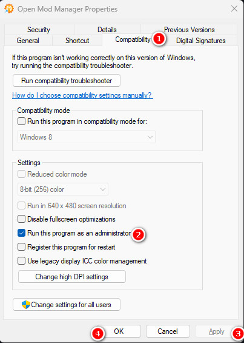
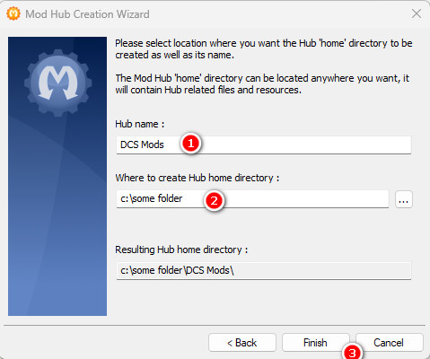
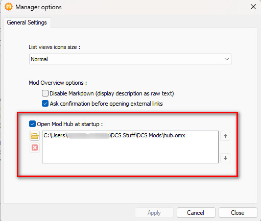
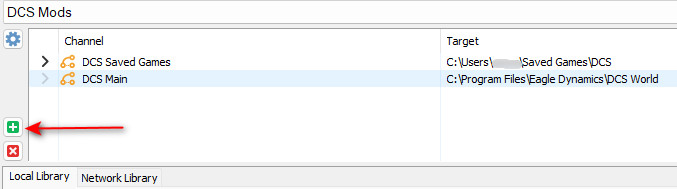
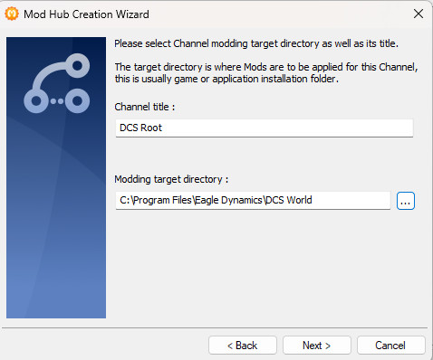
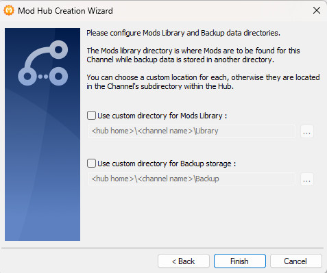
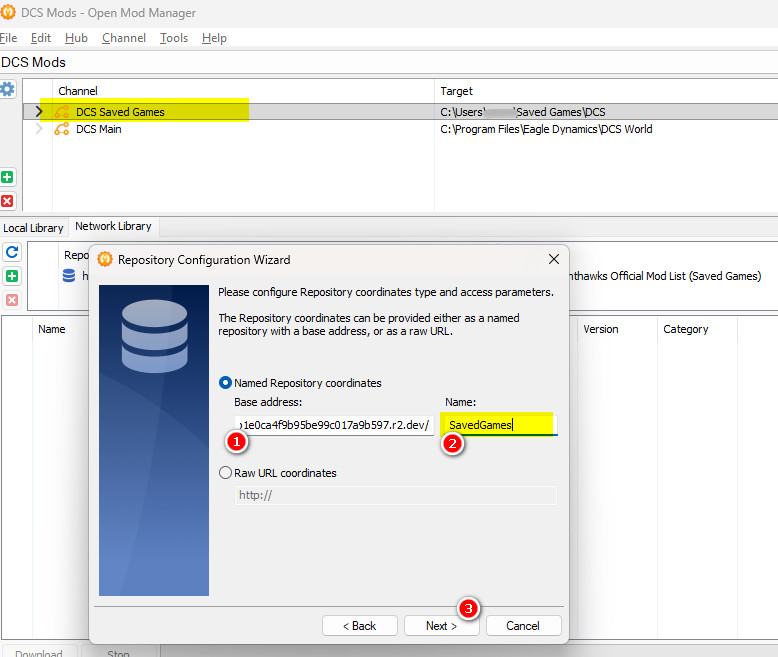
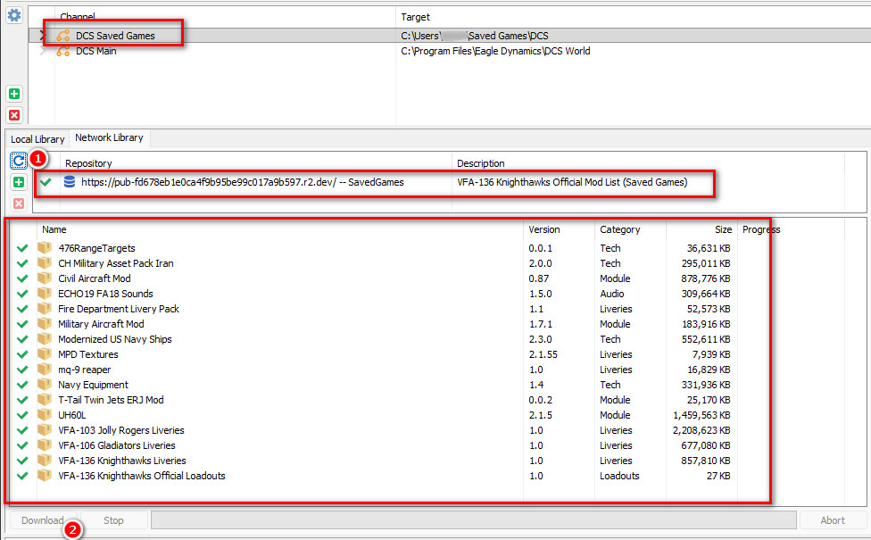
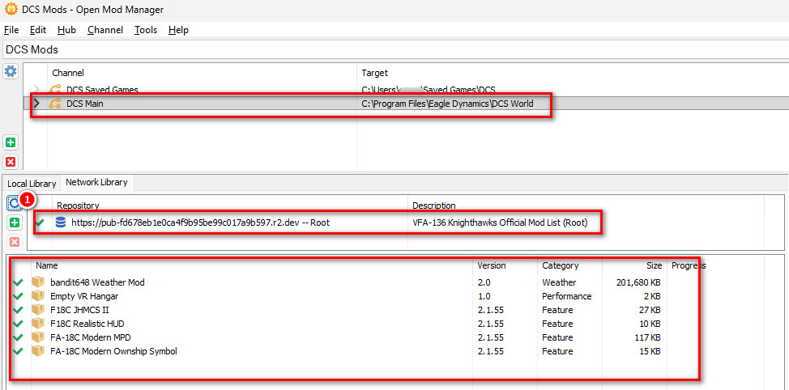
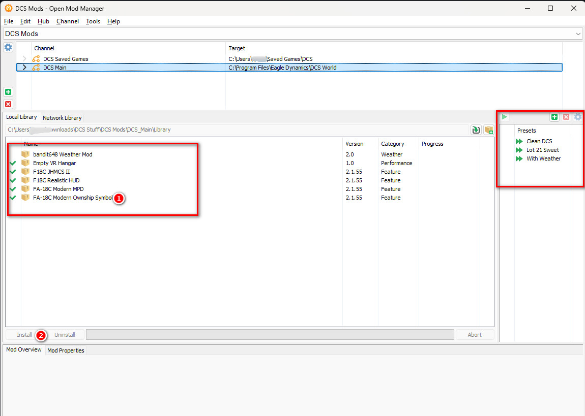

# VFA-136 Knighthawks Official DCS Mod Repository for OpenModManager (OMM)

>Document version 1.0 (Updated: 2025-12-24)

## Introduction

Here is the guide to configure your OMM to use the repository.

## Installation Steps

### Step 1 - Install or update OpenModManager to the latest version (at least v1.3.4 is required). 

#### Available [here](https://github.com/iquercorb/OpenModMan)

### Step 2 - Depending on your installation location for DCS, you will probably need to run OMM as Administrator

#### Right click your OMM shortcut, click Properties -> Compatibilty -> Run this program as an 'Administrator'

### Step 3 - Create a new "Mod Hub" for DCS World

#### Follow the wizard and just pick a location for the Mod Hub. This will store the OMM configuration for DCS World and a local copy of all the mods and backups of files the mod installation process changes.

#### (Optionally) set this "Mod Hub" to open at program start. Edit->Manager Options then fill out the bottom section as so:

### Step 4 - Create two "Channels"

#### One channel is for your DCS "Core" or "Root" folder where DCS is installed

#### Another channel is for your "Saved Games" folder

Repeat the above steps until you have both a DCS Root and DCS Saved Games channel, as seen in the first screenshot of this Step.

### Step 5 - Add a "Network Location" for each "Channel"

Copy from the table below to populate the fields in the wizard.

| **Base address** | **Name** |
| --------------------------------------------------- | ------------------ |
| https://pub-fd678eb1e0ca4f9b95be99c017a9b597.r2.dev/ | SavedGames |
| https://pub-fd678eb1e0ca4f9b95be99c017a9b597.r2.dev/ | Root |

**!Important** Make sure you create the "Network library" for each "Channel"

### Step 6 - Refresh the "Network library" for each "Channel

#### Saved Games Network Library

#### Root Network Library

#### Hightlight the mods you want in each Repository and click "Download"

### Step 7 - Install your desired Mods

#### After downloading, your mods will now be in your "Local libary"

Click "Local libary" and double click any mod you want to install it. 

Double click again to uninstall it

### (Optional) Step 8 - Configure "presets"

#### Recommend you create a "Clean DCS" preset with no mods enabled, useful for updating DCS

#### "Lot 21 Sweet" is a preset for all of our mods installed except the Weather Mod, which is situational.
